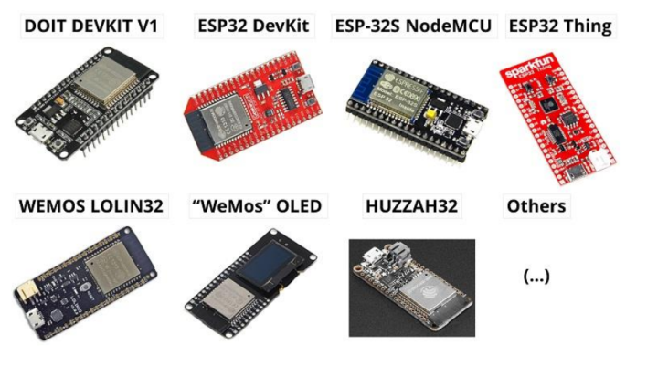
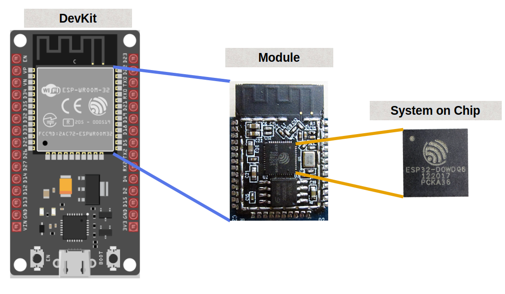
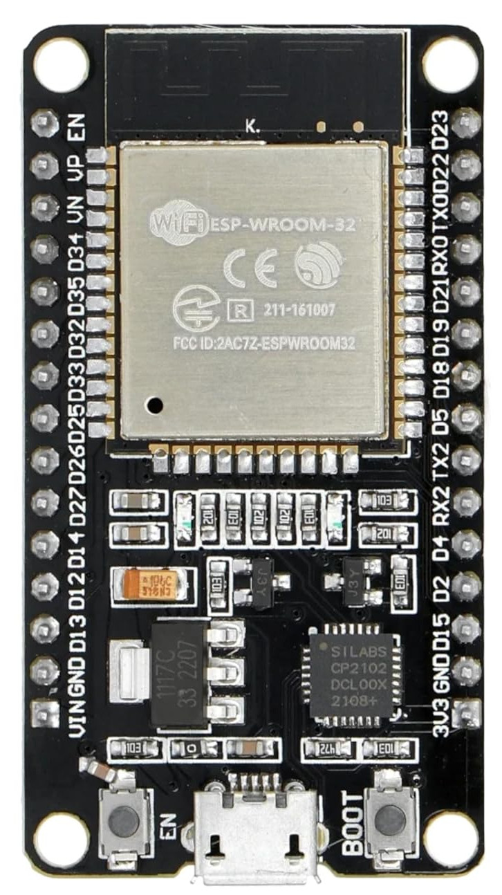

# ESP32

## Pengertian
Keluarga ESP32 adalah serangkaian mikrokontroler System on a Chip (SoC) berbiaya rendah dan hemat daya yang dibuat oleh Espressif. ESP32 merupakan penerus ESP8266 dan sejak itu telah berkembang dengan berbagai varian baru.

## Jenis ESP32
- ESP32
- Seri ESP32 S (ESP32-S2, ESP32-S3)
- Seri ESP32 C (ESP32-C3, ESP32-C6, ESP32-C5)
- ESP32 Seri H (ESP32-H2)
- Seri ESP32-P (ESP32-P4)

## System on Chip (SoC) vs Module vs Development Board (Devkit)

ESP32 memiliki bentuk berbeda: System on Chip (SoC) , Modul , dan Development Board (Devkit) 

Sistem pada Chip (SoC)
SoC adalah core dari ESP32. Sistem pada Chip (System on Chip) mengintegrasikan komponen-komponen penting dari suatu sistem elektronik atau komputer ke dalam satu Sirkuit Terpadu (IC). Dalam kasus SoC ESP32, komponen-komponen tersebut meliputi:

- CPU
- Wi-Fi dan Bluetooth
- ROM dan SRAM
- Addon lain
 
> **Dipembelajaran Semester ini kita akan menggunakan ESP32 Devkit V1**

## ESP32 Devkit V1

## Spec
The ESP32 is a dual-core 32-bit processor equipped with Wi-Fi and Bluetooth, perfect for creating wireless IoT applications.

The following are basic specs for the ESP32:

- Processor: Xtensa 32-bit LX6
- Number of Cores: 2
- Clock Frequency: 240MHz
- Flash Memory: 4 MB
- ROM: 448 KB (read-only programs essential for the operation of the ESP32)
- SRAM: 520 KB (to store data and instructions)
- ADC: 12-bit SAR ADC, 18 channels, 6 Input Pins
- UARTs: 3
- SPIs: 2
- I2Cs: 3
- Wi-Fi: IEEE 802.11 b/g/n/e/i (802.11n up to 150 Mbps)
- Bluetooth: v4.2 BR/EDR and Bluetooth Low Energy (BLE)
- Operation Voltage: 2.3-3.6V
- Deep Sleep: 100uA

## ESP32 Pinout

 

## Keypoints
- GPIO hanya input: Pin GPIO 34, 35, 36, dan 39 cuma bisa dipakai sebagai input, nggak bisa dipakai sebagai output. Di diagram pin biasanya diberi label “GPIX” dan tanda “X” untuk nunjukin kalau output nggak boleh. Kalau bisa, pakai pin yang disorot warna ungu di diagram.

- Flashing dan debugging: GPIO 1 (Tx) dan GPIO 3 (Rx) dipakai untuk keperluan flashing dan debugging.

- Pin ADC: Pin yang bertuliskan ADC1_[angka] itu bagian ADC1, sedangkan yang tertulis ADC2_[angka] itu bagian ADC2.

> ## **So Gimana cara Pakainya?** > [Scripting di Arduino IDE ](3-Arduino%20IDE.md)