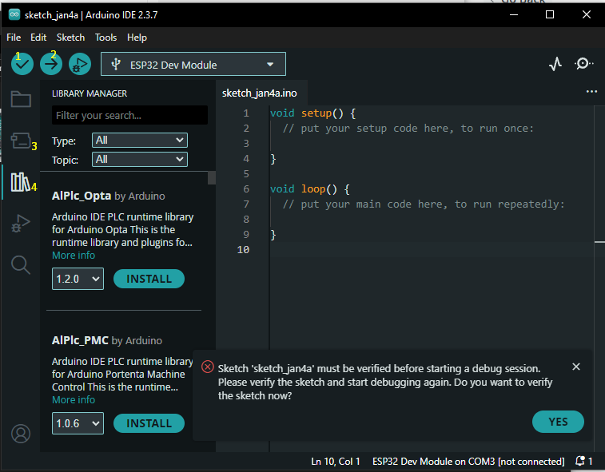
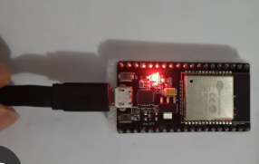
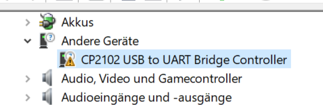
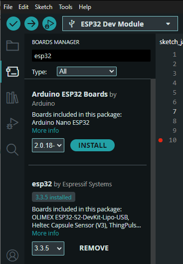
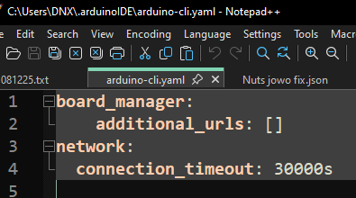
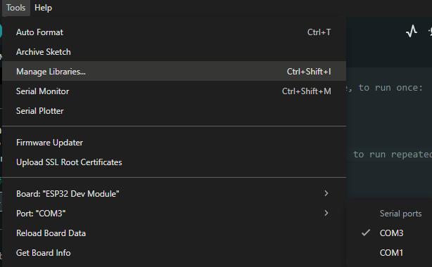

# Arduino IDE

**Arduino IDE** adalah Code editor (Integrated Development Environment) yang sederhana untuk menulis, meng-compile, dan mengunggah program ke Arduino dan banyak board lain (termasuk ESP32 setelah menambahkan board melalui Board Manager). 

> Arduino IDE dapat didownload [docs.arduino.cc/software/ide](https://docs.arduino.cc/software/ide/)

## Fitur Utama

1. **Verify** (compile) untuk memverifikasi script
2. **Upload** untuk upload script ke micro controller
3. **Board Manager** untuk memilih dan menambahkan support board
4. **Library Manager** untuk menambahkan support library
5. **sketch.ino** sebagai tempat untuk menuliskan code 

## Cara Menggunakan Arduino IDE untuk ESP32
1. Colokan kabel data ke Komputer <br>


2. Cek di ***Device manager*** apakah ada driver CP210x terinstall atau belum,
karena esp32 membutuhkan driver tersebut untuk berjalan di windows. [kilik untuk download driver CP210x](https://www.silabs.com/software-and-tools/usb-to-uart-bridge-vcp-drivers) <br> 


3. Buka Arduino IDE dan install board library ***esp32 by espressif*** jika time out terus maka tamabh i waktu timeoutnya di arduino-cli.yaml 

 

4. Buka Tools -> Board -> pilih board ***ESP32 Dev Module***  dan pilih port  Tools -> Port -> ***COM...*** sesuaikan dengan port yang digunakan ESP32


5. Coba buat Script sederhana Blinking LED internal yang berada di pin **D2**
```cpp
#define LED_PIN 2

void setup() {
  pinMode(LED_PIN, OUTPUT);
}

void loop() {
  digitalWrite(LED_PIN, HIGH);
  delay(1000);
  digitalWrite(LED_PIN, LOW);
  delay(1000);
}
```

6. upload script ke ESP32 dengan klik **->**


> ## **Pelajari Scriptnya** > [Pelajari script](3-Arduino%20IDE.md)